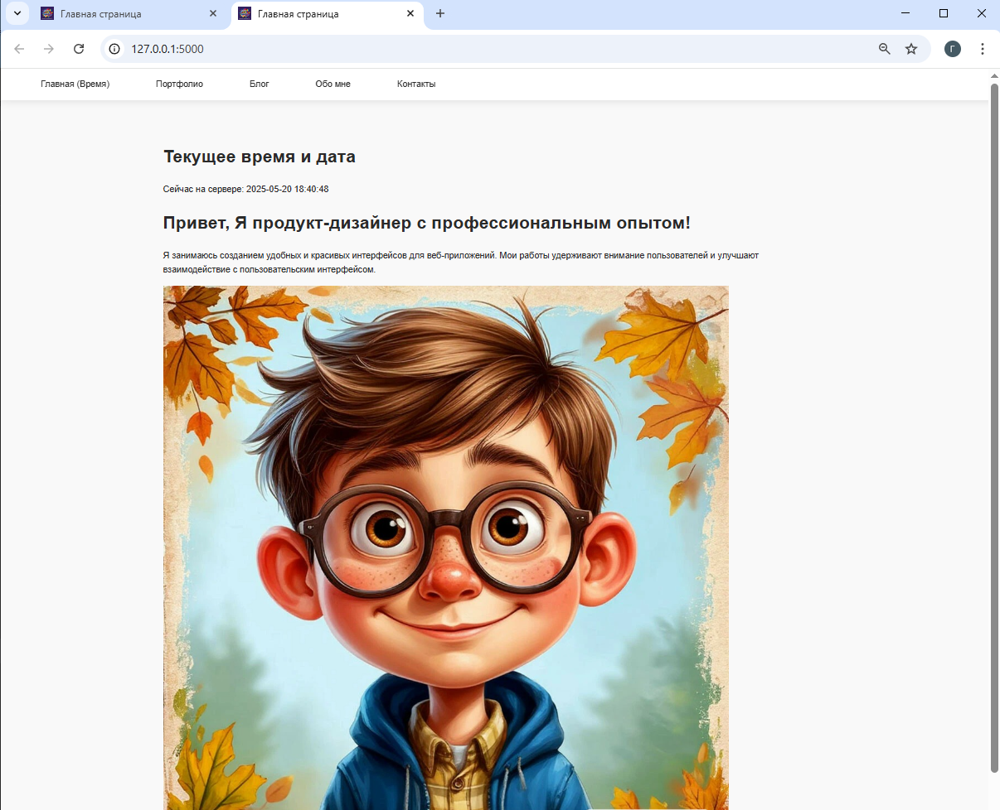

# flask-time-app
```markdown
# Портфолио UI/UX дизайнера



Современное веб-портфолио с адаптивным дизайном, анимациями и динамическим контентом.
Проект реализован на Flask с использованием современных веб-технологий.

## 🌟 Особенности

- **Современный минималистичный дизайн** с акцентом на контент
- **Адаптивная верстка** для всех устройств
- **Интерактивные элементы**:
  - Плавные hover-эффекты
  - Анимация загрузки контента
  - Динамическая галерея портфолио
- **Система навигации** с фиксированным меню
- **Специализированные страницы**:
  - Главная с текущим временем
  - Портфолио проектов
  - Блог с записями
  - Контакты с социальными сетями
  - Обо мне с профилем

## 🛠 Технологии

- **Backend**: Python 3.9+, Flask
- **Frontend**: HTML5, CSS3 (Flexbox/Grid), JavaScript (ES6+)
- **Дополнительно**:
  - Jinja2 шаблонизация
  - CSS-переменные
  - Font Awesome иконки
  - Оптимизированные изображения

## 🚀 Установка и запуск

1. Клонируйте репозиторий:
```bash
git clone https://github.com/JohnDroben/flask-time-app.git
cd flask-portfolio
```

2. Установите зависимости:
```bash
pip install -r requirements.txt
```

3. Запустите приложение:
```bash
python app.py
```

4. Откройте в браузере:  
http://localhost:5000

## 📂 Структура проекта

```
flask-portfolio/
├── static/
│   ├── css/
│   │   └── style.css
│   ├── images/
│   │   ├── project2.jpg
│   │   └── карточка1.jpg
│   └── favicon.ico
├── templates/
│   ├── base.html
│   ├── index.html
│   ├── home.html
│   ├── about.html
│   ├── blog.html
│   └── contacts.html
├── app.py
├── requirements.txt
└── README.md
```

## 🔍 Основные компоненты

### `app.py`
- Маршрутизация между страницами
- Динамическая передача времени на главную страницу
- Конфигурация Flask-приложения

### Шаблоны (templates/)
- Наследование шаблонов через `base.html`
- Блочная система Jinja2
- Повторно используемые компоненты

### Стили (static/css/)
- Современная CSS-архитектура
- CSS-переменные для цветовой схемы
- Адаптивные медиа-запросы
- Плавные анимации

## 📝 Лицензия

Этот проект распространяется под лицензией MIT. Подробности см. в файле [LICENSE](LICENSE).

---

**Автор**: [Drobenuyk George](https://github.com/JohnDroben)  
**Дата создания**: Май 2025  
**Последнее обновление**: Май 2025
```

Этот README:
1. Дает полное представление о проекте
2. Содержит инструкции для быстрого старта
3. Визуально структурирован
4. Подчеркивает ключевые особенности
5. Подходит для размещения на GitHub/GitLab

